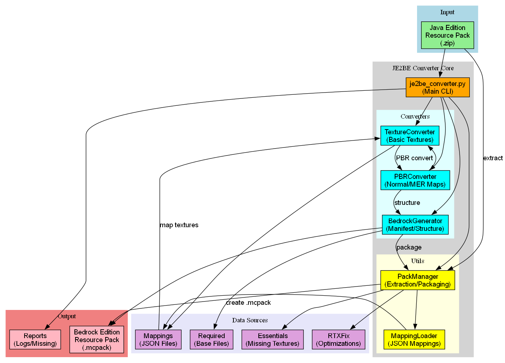
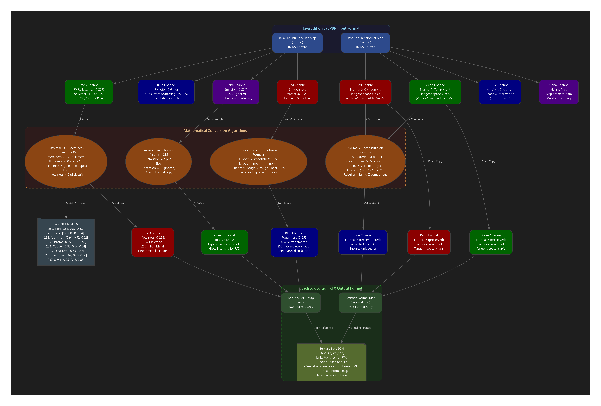
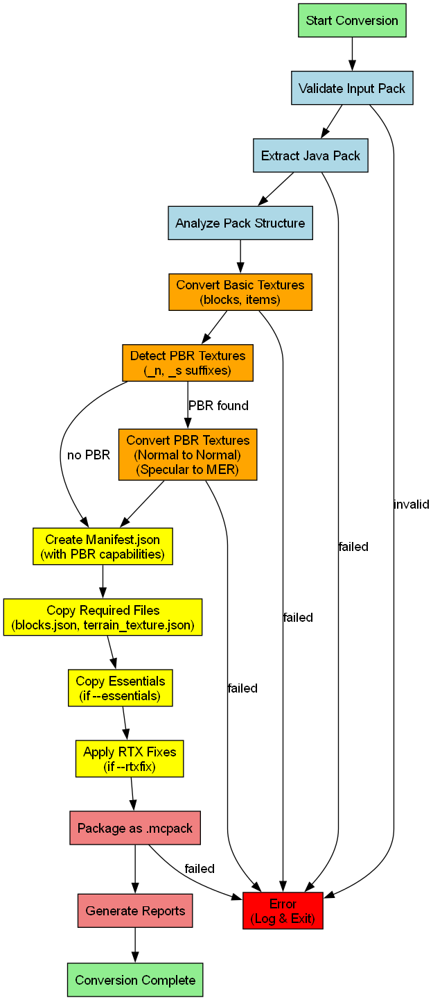

<div align="center">


# JE2BE Resource Pack Converter

**Convert Minecraft Java Edition resource packs to Bedrock Edition format with full PBR/RTX support**

[](https://opensource.org/licenses/MIT)
[](https://www.python.org/downloads/)
[](https://github.com/Seraphic-Studio/JE2BE-Resource-Pack-Converter)

</div>

## Features

**Texture Conversion** - Convert Java Edition textures to Bedrock Edition format  
**PBR/RTX Support** - Automatic conversion of LabPBR textures to Bedrock MER format  
**Smart Mapping** - 934+ texture mappings across 9 categories  
**Essential Textures** - Include missing textures from essentials collection  
**RTX Optimizations** - Apply RTX-specific fixes and optimizations  
**Validation** - Verify missing mappings against actual input pack  
**CLI Interface** - Clean command-line interface for automation

## Architecture Overview



## Quick Start

### Download Executable (Recommended)
Download the latest `je2be.exe` from [releases](https://github.com/Seraphic-Studio/JE2BE-Resource-Pack-Converter/releases) for instant use.

```bash
# Basic conversion
je2be.exe convert pack.zip output.mcpack

# Full conversion with all features
je2be.exe convert pack.zip output.mcpack --essentials --rtxfix
```

### Python Installation
```bash
git clone https://github.com/Seraphic-Studio/JE2BE-Resource-Pack-Converter
cd je2be
pip install -r requirements.txt
python je2be_converter.py convert pack.zip output.mcpack
```

## Usage Examples

```bash
# Convert with essential textures
je2be.exe convert pack.zip output.mcpack --essentials

# Convert with RTX optimizations
je2be.exe convert pack.zip output.mcpack --rtxfix

# Custom pack name and description
je2be.exe convert pack.zip output.mcpack --pack-name "My Pack" --pack-description "Custom description"

# Disable PBR conversion
je2be.exe convert pack.zip output.mcpack --disable-pbr

# Show mapping information
je2be.exe info

# Validate mappings
je2be.exe validate
```

## PBR/RTX Conversion

The converter automatically detects and converts LabPBR textures:



**Conversion Process:**
- **Normal Maps**: `_n.png` → Bedrock normal maps
- **Specular Maps**: `_s.png` → Bedrock MER maps (Metallic/Emissive/Roughness)
- **Texture Sets**: Automatic JSON generation for RTX compatibility

## Conversion Flow



## Requirements

- **Input**: Java Edition resource pack (`.zip` file)
- **Output**: Bedrock Edition resource pack (`.mcpack` file)
- **Supports**: Minecraft Java Edition 1.8+ textures
- **Target**: Minecraft Bedrock Edition with RTX support

## Building from Source

```bash
# Build executable
python build.py
```

## Credits

- **RTX Fixes**: Thanks to [MADLAD3718/MCRTX-Bug-Fixes](https://github.com/MADLAD3718/MCRTX-Bug-Fixes) for RTX optimization techniques
- **PBR Standards**: Based on LabPBR and Bedrock RTX material specifications

## License

This project is licensed under the MIT License - see the [LICENSE](LICENSE) file for details.


---

<div align="center">

**Made with ❤️ for the Minecraft community**

</div>
